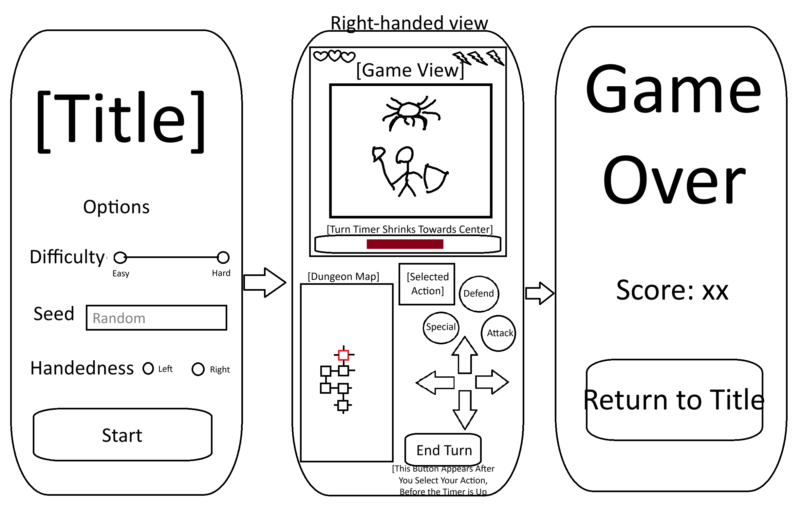

## Project map

This repository has two app shells backed by shared game rules:

- `src/app/` is the Expo Router app used on Android and iOS. `index.tsx` is the title screen, `setup.tsx` configures a run, and `game.tsx` is the single-player screen.
- `app/` is the Next.js browser app. `page.tsx` currently holds its title, setup, settings, game, multiplayer, and game-over screens in one file.
- `src/game/` contains shared rules and state. Start with `src/game/README.md`; balance values live in `config/gameparameters.js`, class behavior/text in `config/game-classes.ts`, and multiplayer turn resolution in `engine/run-game-multiplayer.ts`.
- `src/components/` contains shared UI. Files ending in `.web.tsx` are browser-specific implementations selected by the web bundler; check the matching native file when changing a shared component.
- `src/multiplayer/` contains the WebRTC connection adapters and its README covers setup and limitations.
- `__tests__/` contains the Jest tests, and `visual-tests/` contains Playwright browser checks.

## Change map and duplication

- The single-player game screen exists in both `src/app/game.tsx` and `app/page.tsx`. Gameplay UI changes generally need to be applied to both; shared game rules should go in `src/game/` instead. The Next.js version also owns its screen state and timer setup in `app/page.tsx`.
- Expo runs `src/game/engine/run-game-loop.ts` through React Native Game Engine. The Next.js screen currently drives the same loop from a `setInterval` in `app/page.tsx`. If changing turn-clock behavior, check both integrations as well as the shared loop.
- Native and web variants are also present for `ScreenShell`, `ActionButton`, `Walls`, `PlayerHUD`, and `EnemyFeedback`; keep their behavior aligned where the user-facing component is shared.
- Game tuning has a central table in `src/game/config/gameparameters.js`, but class details live separately in `src/game/config/game-classes.ts`. Search both before changing balance or player-facing class descriptions.

## Wireframe

## HIG and Material Design:

- HIG Game Design says you should be capable of playing right after installing, you should figure out how to play with playable tutorials rather than text explanations, and the default settings should be best for most users (https://developer.apple.com/design/human-interface-guidelines/designing-for-games). My project is so simple you can start playing immediately, there's no written tutorial you must go through when starting, and the default settings assume a desire for moderate difficulty, not having a specific seed in mind, and right-handedness.
- Material Design for Buttons says that each screen should have one prominent button for that screen's primary action, and that this primary button should be a filled button, which is a button where the text matches the screen background and the rest of the button is filled in with another color. (https://m3.material.io/components/all-buttons). I follow this with the "Start" and "Return to Title" buttons on the landing screen and game over screen, respectively, but deviate for the gameplay screen because no one game action is dominant, so there are several buttons of equal weight and emphasis instead of one primary action. It also says that segmented buttons, like the (currently non-functional) segmented button used for selecting game difficulty from the landing screen, should have between 2 and 5 options and have short, succinct labels (https://m3.material.io/components/segmented-buttons/guidelines), which the difficulty segmented button does.

## HIG and Material Design, Part II
- Human Interface Guidelines says that there are four button roles - Primary for the non-destructive thing the user is most likely to do, Destructive for actions that can result in deleting things, Cancel to cancel the current action, and Normal for everything - and that Primary buttons should use the app's accent color, while Destructive buttons should use the app's main red. It also says that Help buttons should be circular, consistently sized buttons with a question mark inside that display relevant documentation when pressed, with no more than one help button per window (https://developer.apple.com/design/human-interface-guidelines/buttons). I use the four main buttons roles in my app, Primary for things like "Start Game" and "Return to Title," Destructive for "Quit to Title" (since that destroys your run data), cancel for quitting out of the "Quit to Title" button, and normal buttons for settings and such. I use help buttons that are cicular, with question marks, and pull up relevant documentation, but I use multiple on the home screen for the different main game settings, since I wanted separate documentation for each and I feel their placement makes it clear enough what each is helping you with.

## Other Packages:

- Expo Vector Icons - used for health, energy, and direction buttons on the game screen.
- Expo Haptics - makes the phone vibrate when the player takes damage.
- React Native Game Engine - Helps with rendering and updating the screen with animations.
